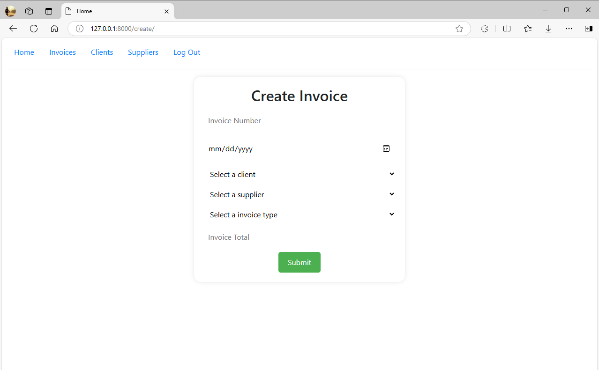
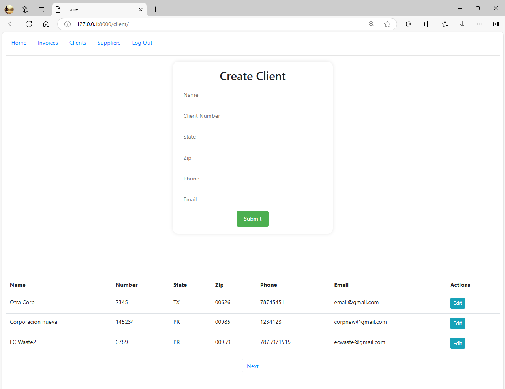
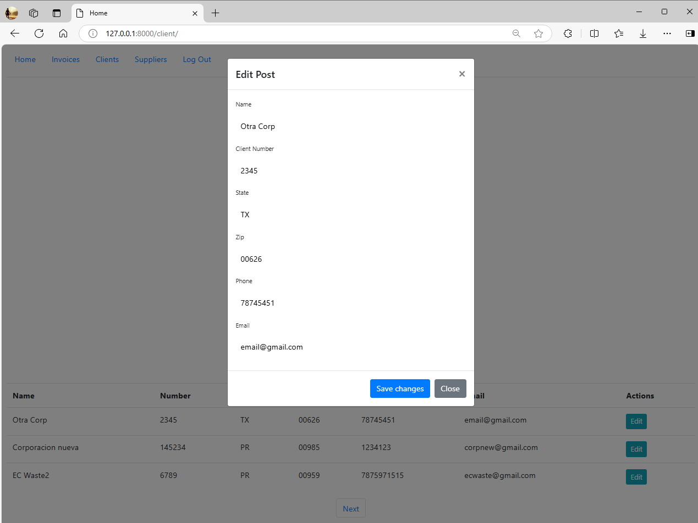
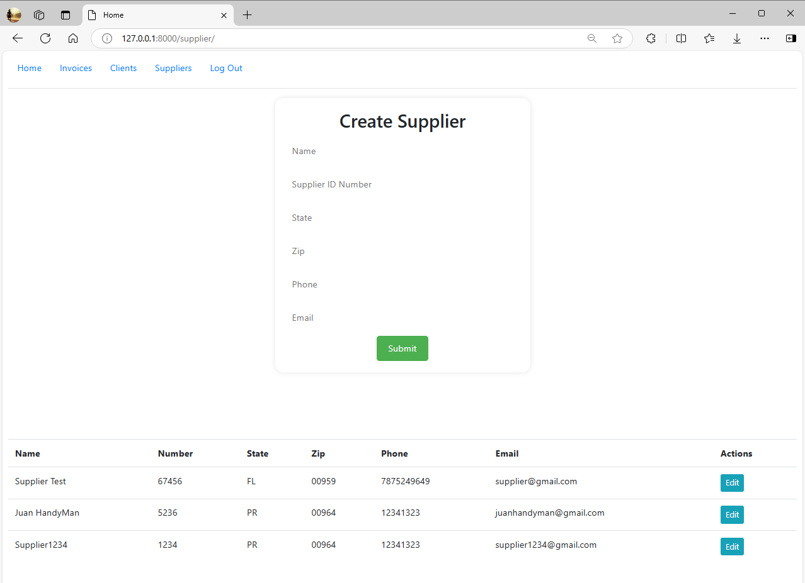
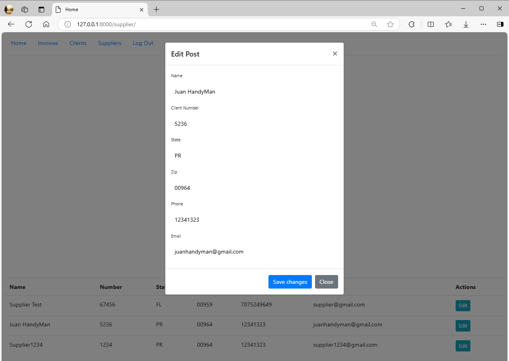

# README.md

## Project Overview

This project is a comprehensive Invoices Application built using Django. The application allows users to manage invoices, clients, and suppliers. Users can create, read, update, and delete invoices for clients and suppliers. The application is designed with a user-friendly interface and provides a seamless experience for managing invoices.

## Distinctiveness and Complexity

This project stands out due to its complexity and distinctiveness. Unlike other projects, it involves a more complex data model, including relationships between invoices, clients, and suppliers. It also includes a pagination feature, which is not commonly found in other projects. The application is built using Django, a high-level Python Web framework that encourages rapid development and clean, pragmatic design. This adds to the complexity as it involves understanding and implementing Django's various components such as views, templates, and models.

## File Contributions

- `index.html`: This file contains the main HTML structure of the application. It includes a table for displaying the invoices and navigation for pagination.
- `models.py`: This file contains the data models for the application, including the Invoice, Client, and Supplier models.
- `views.py`: This file contains the views for the application. It includes the logic for displaying the invoices, handling pagination, and managing clients and suppliers.
- `urls.py`: This file contains the URL configurations for the application.

## Application File Structure
```
┣ 📂__pycache__
┃ ┣ 📜__init__.cpython-312.pyc
┃ ┣ 📜admin.cpython-312.pyc
┃ ┣ 📜apps.cpython-312.pyc
┃ ┣ 📜models.cpython-312.pyc
┃ ┣ 📜urls.cpython-312.pyc
┃ ┗ 📜views.cpython-312.pyc
┣ 📂migrations
┃ ┣ 📂__pycache__
┃ ┃ ┣ 📜__init__.cpython-312.pyc
┃ ┃ ┣ 📜0001_initial.cpython-312.pyc
┃ ┃ ┗ 📜0002_remove_client_clientaddress_and_more.cpython-312.pyc
┃ ┣ 📜__init__.py
┃ ┣ 📜0001_initial.py
┃ ┗ 📜0002_remove_client_clientaddress_and_more.py
┣ 📂static
┃ ┗ 📂invoices
┃   ┗ 📜styles.css
┣ 📂templates
┃ ┗ 📂invoices
┃   ┣ 📜client.html
┃   ┣ 📜create.html
┃   ┣ 📜index.html
┃   ┣ 📜layout.html
┃   ┣ 📜login.html
┃   ┣ 📜register.html
┃   ┗ 📜supplier.html
┣ 📜__init__.py
┣ 📜admin.py
┣ 📜apps.py
┣ 📜models.py
┣ 📜tests.py
┣ 📜urls.py
┗ 📜views.py
```

## Project File Structure
```
┣ 📂finalproject
┃ ┣ 📂__pycache__
┃ ┣ 📜__init__.py
┃ ┣ 📜asgi.py
┃ ┣ 📜settings.py
┃ ┣ 📜urls.py
┃ ┗ 📜wsgi.py
┣ 📜.gitignore
┣ 📜db.sqlite3
┣ 📜manage.py
┣ 📜readme.md
┗ 📜requirements.txt
```

## Application Screenshots

Here are some screenshots of the application:


This is the home page of the application. It provides an overview of the invoices and allows users to navigate through the application. Users can view, create, update, and delete invoices from this page. The table displays important information about each invoice, such as the client, supplier, and total amount. The pagination feature allows users to easily navigate through multiple pages of invoices.













1. Install the required Python packages by running `pip install -r requirements.txt`.
2. Navigate to the project directory and run `python manage.py runserver`.
3. Open a web browser and visit `http://localhost:8000` to access the application.

## Additional Information

The application uses Django's built-in user authentication for managing user sessions. Users must register and login to access the invoices.

## Python Packages

The application requires the following Python packages:

- Django
- django-crispy-forms

These packages are included in the `requirements.txt` file.