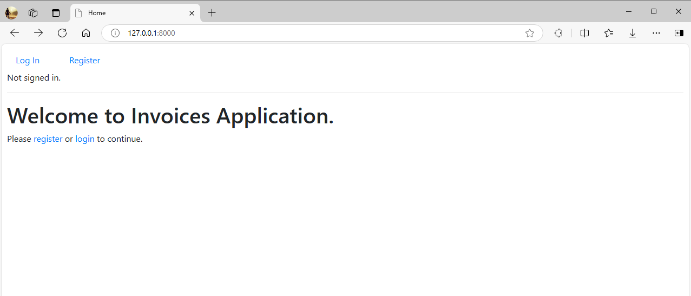
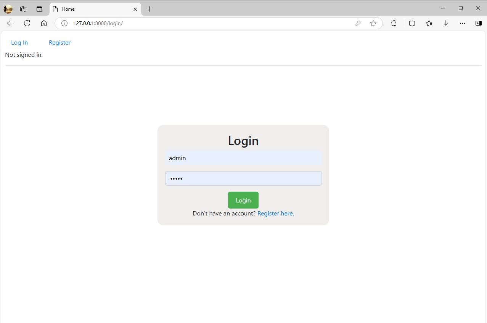
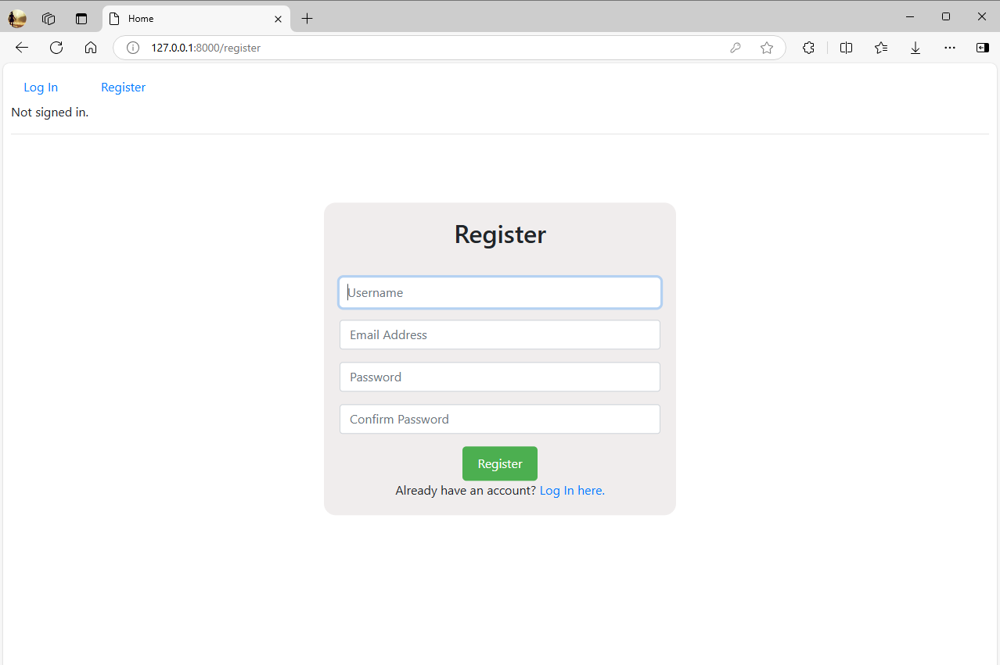
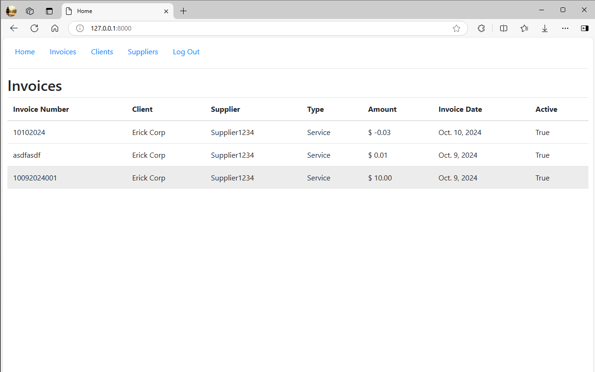

# README.md

## Project Overview

This project is a comprehensive Invoices Application built using Django. The application allows users to manage invoices, clients, and suppliers. Users can create, read, update, and delete invoices for clients and suppliers. The application is designed with a user-friendly interface and provides a seamless experience for managing invoices.

## Distinctiveness and Complexity

This project stands out due to its complexity and distinctiveness. Unlike other projects, it involves a more complex data model, including relationships between invoices, clients, and suppliers. It also includes a pagination feature, which is not commonly found in other projects. The application is built using Django, a high-level Python Web framework that encourages rapid development and clean, pragmatic design. This adds to the complexity as it involves understanding and implementing Django's various components such as views, templates, and models.

This Invoices Application is distinct from previous projects for several reasons:

1. Complex Data Relationships: This application manages complex relationships between invoices, clients, and suppliers. This involves more advanced database modeling and querying than previous projects.

2. User Authentication: The application incorporates Django's built-in user authentication system. This allows for user registration, login, and session management, adding a layer of complexity not present in previous projects.

3. Form Handling and Validation: The application uses Django forms for creating and updating invoices, clients, and suppliers. This involves form handling and validation, which adds to the complexity of the project.

4. Pagination: The application implements pagination for displaying invoices. This is a more advanced feature that requires additional logic in the views and templates.

5. UI/UX Design: The application has a more sophisticated user interface compared to previous projects. It includes a navigation bar, forms for data entry, and tables for data display. This requires a deeper understanding of HTML, CSS, and Django templates.

6. Use of Third-Party Libraries: The application uses the django-crispy-forms library to manage form rendering. This adds to the complexity as it involves understanding and integrating third-party libraries.

These points highlight the distinctiveness and complexity of this project compared to previous ones. It's not just about building a web application, but about managing complex data relationships, user interactions, and advanced features like pagination and form handling.

## File Contributions

- `index.html`: This file contains the main HTML structure of the application. It includes a table for displaying the invoices and navigation for pagination.
- `models.py`: This file contains the data models for the application, including the Invoice, Client, and Supplier models.
- `views.py`: This file contains the views for the application. It includes the logic for displaying the invoices, handling pagination, and managing clients and suppliers.
- `urls.py`: This file contains the URL configurations for the application.

## Application File Structure
```
┣ 📂__pycache__
┃ ┣ 📜__init__.cpython-312.pyc
┃ ┣ 📜admin.cpython-312.pyc
┃ ┣ 📜apps.cpython-312.pyc
┃ ┣ 📜models.cpython-312.pyc
┃ ┣ 📜urls.cpython-312.pyc
┃ ┗ 📜views.cpython-312.pyc
┣ 📂migrations
┃ ┣ 📂__pycache__
┃ ┃ ┣ 📜__init__.cpython-312.pyc
┃ ┃ ┣ 📜0001_initial.cpython-312.pyc
┃ ┃ ┗ 📜0002_remove_client_clientaddress_and_more.cpython-312.pyc
┃ ┣ 📜__init__.py
┃ ┣ 📜0001_initial.py
┃ ┗ 📜0002_remove_client_clientaddress_and_more.py
┣ 📂static
┃ ┗ 📂invoices
┃   ┗ 📜styles.css
┣ 📂templates
┃ ┗ 📂invoices
┃   ┣ 📜client.html
┃   ┣ 📜create.html
┃   ┣ 📜index.html
┃   ┣ 📜layout.html
┃   ┣ 📜login.html
┃   ┣ 📜register.html
┃   ┗ 📜supplier.html
┣ 📜__init__.py
┣ 📜admin.py
┣ 📜apps.py
┣ 📜models.py
┣ 📜tests.py
┣ 📜urls.py
┗ 📜views.py
```

## Project File Structure
```
┣ 📂finalproject
┃ ┣ 📂__pycache__
┃ ┣ 📜__init__.py
┃ ┣ 📜asgi.py
┃ ┣ 📜settings.py
┃ ┣ 📜urls.py
┃ ┗ 📜wsgi.py
┣ 📜.gitignore
┣ 📜db.sqlite3
┣ 📜manage.py
┣ 📜readme.md
┗ 📜requirements.txt
```

## Application Screenshots

Here are some screenshots of the application:



This is the home page of the application. It provides an overview of the invoices and allows users to navigate through the application. Users can view, create, update, and delete invoices from this page. The table displays important information about each invoice, such as the client, supplier, and total amount. The pagination feature allows users to easily navigate through multiple pages of invoices.








## Installation and Setup

1. Clone the repository to your local machine using `git clone git@github.com:biojoel21/harvardfinalproject.git`.

2. Recommended to create a virtual environment using `python -m venv env` and activate it using `source env/bin/activate`.

3. Install the required Python packages by running `pip install -r requirements.txt`.

4. Run the Django migrations using `python manage.py migrate`.

5. Create a superuser account using `python manage.py createsuperuser` and follow the prompts to create a superuser account.

6. Run the Django development server using `python manage.py runserver`.

7. Open a web browser and navigate to `http://localhost:8000` to access the application.

## Additional Information

The application uses Django's built-in user authentication for managing user sessions. Users must register and login to access the invoices. The application also includes a registration form for new users to create an account.